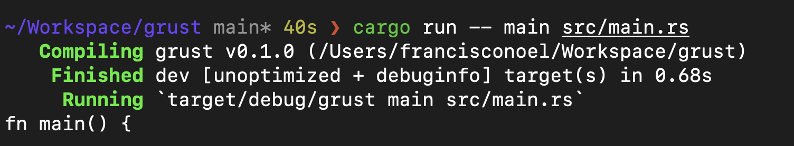

# GRUST

A grep command line tool written in rust

## EXAMPLE

When running `cargo run -- argument file` for any argument inside a given file,
the program would print out the primary occurrence of the argument.

